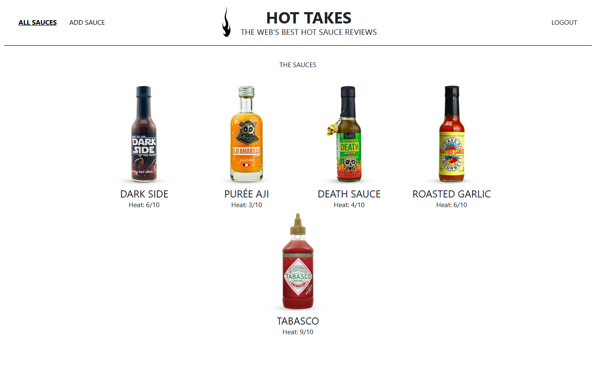

# PIIQUANTE

## Projet 6 du parcours Développeur Web d'Openclassrooms.

Le client, la marque de condiments à base de piment Piiquante, veut développer une application web de critique des sauces piquantes appelée « Hot Takes ».

## Objectifs

- Gérer le backend en MVP de l'application en créant une API avec javascript.
- Utiliser une base de donnée Mongodb pour enregistrer les utilisateurs, leurs sauces et les avis (likes, dislikes).
- Sécuriser l'API.
- Mettre en œuvre des opérations CRUD de manière sécurisée.

## Front

- Cloner le repo
- Ouvrir le terminal dans le dossier front et exécuter `npm install` pour installer les dépendances.
- Exécuter `npm install node-sass` pour installer sass.
- Le projet a été généré avec Angular CLI version 7.0.2.
- Démarrer `ng serve`.
- Rendez-vous sur http://localhost:4200.

## Back

- Ouvrir le terminal dans le dossier back.
- Charger le package nodemon : `npm install -g nodemon`.
- Lancer le serveur: `nodemon server`.

## Note technique

- La partie front a été créé avec angular CLI version 13.2.4. 
- Angular a du être mis à jour pour être compatible avec la version node disponible sur le moment. Voici la liste des versions des dépendances à utiliser pour faire fonctionner le projet :

Package                         Version
---------------------------------------------------------
@angular-devkit/architect       0.1700.5
@angular-devkit/build-angular   17.0.5
@angular-devkit/core            17.0.5
@angular-devkit/schematics      17.0.5
@angular/cdk                    13.2.4
@angular/material               13.2.4
@schematics/angular             17.0.5
rxjs                            7.5.4
typescript                      5.2.2
zone.js                         0.14.2
